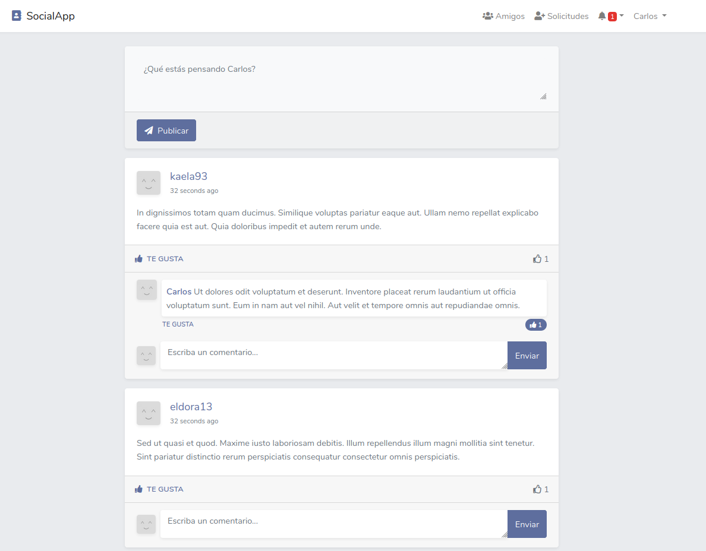

## Red Social con Laravel y Vue con TDD
Red Social con laravel 7 y vuejs con notificaciones en tiempo real.

Esta aplicacion fue realizada con la metodologia **TDD** (Desarrollo guiada por pruebas).



La aplicacion consiste con las siguientes caracteristicas:

* Crear estados y visualizarlos en tiempo real
* Dar me gusta a los estados y comentarios en tiempo real
* Notificar al usuario que se dio me gusta a un estado y/o comentarios en tiempo real
* Notificar al usuario quienes comentaron sus estados
* Ver el perfil de usuario y sus estados
* Enviar solicitudes de amistad a usuarios
* Notificar solicitudes enviadas por otros usuarios
* Aceptar, denegar y/o eliminar solicitudes de amistad de usuarios
* Vista de amigos de usuarios

### Instalación
Realizar los siguientes comandos:

Clonar el repositorio

```bash
$ git clone https://github.com/carlossantesp/socialapp.git
```

Instala los paquetes de composer

```bash
$ composer install
```

Instala los paquetes de npm

```bash
$ npm install
$ npm run dev
```

Copiar el archivo `.env-example` y renombrar por `.env`

```bash
cp .env-example .env
```

### Configuracion

Para configurar la aplicacion realizar los siguientes pasos

Generar la key del la aplicacion

```bash
$ php artisan key:generate
```

Configurar la base de datos en el archivo `.env`

```text
DB_CONNECTION=mysql
DB_HOST=127.0.0.1
DB_PORT=3306
DB_DATABASE=basedatos
DB_USERNAME=root
DB_PASSWORD=
```

> En `DB_DATABASE` debe colocar el nombre de la base de datos y `DB_USERNAME` el usuario para conectarse a la base de datos por defecto es `root` y en `DB_PASSWORD` la contraseña a la base de datos

Crear la migraciones de la tablas de la base de datos

```bash
$ php artisan migrate
```

### Configuracion del Websocket
Esta aplicacion usa el paquete `laravel-websockets` por lo que necesitara configurarlo

Crea una cuenta en [pusher.com](https://pusher.com) y cree una key para usarlo en la aplicacion

En el archivo `.env` colocar los datos en las siguientes variables

```text
PUSHER_APP_ID=
PUSHER_APP_KEY=
PUSHER_APP_SECRET=
PUSHER_APP_CLUSTER=
```
> El paquete `laravel-websockets` usar internamente pusher por eso se debe colocar estas credenciales, pero no usa el servidor websocket de pusher.

### Iniciando la aplicacion

Primero debe iniciar el servidor websocket

```bash
$ php artisan websockets:serve
```

Inicie el servidor web de la aplicacion

```bash
$ php artisan serve
```
La dirección del servidor es [http://127.0.0.1:8000/](http://127.0.0.1:8000/)
